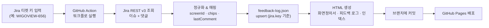

# WIGOVIEW 화면정의서 · 피드백 로그 자동화

Jira 티켓 하나(예: `WIGOVIEW-656`)를 입력하면 **화면정의서(screen definition document)** 와 **피드백 로그(feedback log)** 를 자동으로 생성/갱신하는 스캐폴드입니다. 결과물은 Figma 피드백 로그 포맷을 미러링한 정적 HTML이며, GitHub Pages로 게시하거나 복사·임베드하거나 추후 Figma 플러그인으로 소비할 수 있습니다.

- **런타임**: Node.js 20+ (네이티브 `fetch`, ESM). 외부 의존성 0개, 빌드 스텝 없음.
- **실행 위치**: GitHub Actions (사내 egress 정책으로 로컬/에이전트 환경에서는 Jira 접근 불가).

---

## 왜 GitHub Actions에서 실행하나 (두 가지 블로커)

이 자동화가 필요로 하는 두 외부 시스템은 **개발/에이전트 환경에서 직접 접근이 차단**되어 있습니다.

1. **Jira (`bfly.atlassian.net`) 접근 차단** — 사내 egress 정책으로 개발 환경에서 Atlassian 호스트로 나가는 요청이 막힙니다.
   → **GitHub Actions 러너는 인터넷(Jira)에 접근 가능**하므로, 실제 티켓 조회는 Actions에서 수행합니다. 인증 정보는 저장소 Secrets로 안전하게 주입됩니다.

2. **Figma (`figma.com`) 쓰기 불가** — Figma 디자인은 커넥터를 통해 **읽기 전용**으로만 접근됩니다. 자동으로 Figma 파일에 쓸 수 없습니다.
   → 그래서 산출물을 **Figma 포맷을 모사한 HTML**로 생성합니다. 이 HTML을 임베드/링크/붙여넣거나, 추후 Figma 플러그인이 읽어 들이도록 설계했습니다.

> **화면정의서 비주얼 레이아웃 안내**: 본 스캐폴드의 화면정의서 HTML 레이아웃은 Figma 템플릿(노드 `2956-18603`)의 **best-effort 복제**입니다. 자동화 환경에서 Figma에 접근할 수 없어 실제 스타일과 100% 일치하지는 않을 수 있습니다. **정확한 미세 조정을 위해 해당 Figma 화면의 스크린샷/익스포트를 공유해 주세요.**

---

## 전체 흐름



ASCII 버전:

```
[Jira 티켓 키] -> [GitHub Action] -> [Jira REST v3: 이슈+댓글]
     -> [정규화/매핑] -> [feedback-log.json upsert]
     -> [HTML 생성: 화면정의서/피드백 로그/인덱스] -> [커밋] -> [GitHub Pages]
```

---

## SETUP (최초 1회)

### 1. 저장소 Secrets 등록
`Settings → Secrets and variables → Actions → New repository secret` 에서 3개를 등록합니다.

| Secret 이름 | 값 |
|---|---|
| `JIRA_BASE_URL` | `https://bfly.atlassian.net` |
| `JIRA_EMAIL` | 본인 Jira 계정 이메일 |
| `JIRA_API_TOKEN` | Atlassian API 토큰 ([발급 링크](https://id.atlassian.com/manage-profile/security/api-tokens)) |

### 2. GitHub Pages 활성화 (선택)
`Settings → Pages → Source` 를 **GitHub Actions** 로 설정합니다. 설정하지 않으면 문서는 저장소의 `docs/` 에서 확인할 수 있으며, Pages 배포 스텝은 실패로 처리되지 않도록 되어 있습니다.

---

## 실행 방법

1. GitHub 저장소의 **Actions** 탭으로 이동
2. **"Jira 화면정의서 업데이트"** 워크플로 선택
3. **Run workflow** 클릭
4. `ticket` 입력란에 티켓 키 입력 (예: `WIGOVIEW-656`), 필요 시 `applied_version`(반영 버전) 입력
5. 실행하면 러너가 Jira를 조회 → `data/feedback-log.json` 업서트 → `docs/` HTML 재생성 → 브랜치에 커밋 → (Pages 활성화 시) 자동 배포

### 로컬에서 (인증 없이) 미리보기
Jira 접근 없이도 기존 데이터로 페이지를 렌더링할 수 있습니다.

```bash
node src/cli.js --demo
# 또는
npm run demo
```

인증 정보(.env)를 갖춘 환경(Jira 접근 가능한 곳)이라면:

```bash
cp .env.example .env   # 값 채우기
# dotenv를 쓰지 않으므로 셸에 export 하거나 아래처럼 인라인 지정
JIRA_BASE_URL=... JIRA_EMAIL=... JIRA_API_TOKEN=... node src/cli.js WIGOVIEW-656
```

---

## 산출물 위치

| 파일 | 설명 |
|---|---|
| `docs/index.html` | 인덱스 (화면정의서 목록 + 피드백 로그 링크) |
| `docs/feedback-log.html` | 8개 컬럼 피드백 로그 테이블 |
| `docs/specs/<화면ID>.html` | 화면 ID별 화면정의서 (예: `docs/specs/M-07-009.html`) |
| `data/feedback-log.json` | 원천 데이터 (upsert 대상, source of truth) |

GitHub Pages 활성화 시: `https://<org>.github.io/<repo>/` 에서 열람.

---

## 데이터 스키마 (피드백 로그 컬럼)

| 컬럼 (한글) | Jira 소스 |
|---|---|
| 요소 | 화면 ID = 티켓 제목 접두어 (예: `M-07-009`, `D-04`). 선행 `[QA]` 등 태그는 제거 후 파싱 |
| 유형 | Jira issuetype (예: 버그) → 색상 칩 |
| Jira | 티켓 키 링크 (`.../browse/<KEY>`) + Epic 이름 (`[EPIC] #NN_Name`) |
| 피드백 내용 | 티켓 제목 (화면 ID 접두어 제거, 한 줄) |
| 최근 댓글 | 마지막 댓글 본문(인용) + 작성자 · 날짜(YYYY.MM.DD) · 총 댓글 수 |
| 요청 → 담당 | reporter → assignee (displayName) |
| 상태 | Jira status (예: 종료, 진행 중) → 색상 칩 |
| 반영 버전 | **Jira에 없음** — 수동/선택 입력, 행별 편집. `--version=` 인자 또는 JSON 직접 편집 |

`data/feedback-log.json` 에는 템플릿 확인용 **시드 데이터**(`seed: true`, WIGOVIEW-475 예시)가 포함되어 있습니다. 실제 데이터가 쌓이면 삭제하거나 유지해도 됩니다.

---

## 파일 구조

```
.
├── README.md
├── package.json                         # type:module, node>=20, scripts
├── .gitignore
├── .env.example                         # JIRA_* 3개 변수
├── data/
│   └── feedback-log.json                # 원천 데이터 (rows[], upsert)
├── src/
│   ├── jira.js                          # Jira REST v3 클라이언트 (fetch/Basic auth, ADF→text, 화면ID 파싱)
│   ├── mapping.js                       # 이슈→row / 이슈→spec 매핑, 칩 색상 맵, upsert
│   ├── templates.js                     # HTML 렌더러 + escapeHtml + 공유 CSS
│   ├── generate.js                      # 데이터 읽기/쓰기 + docs/ 재생성
│   └── cli.js                           # 엔트리포인트 (실조회 / --demo)
├── docs/                                # 생성물 (커밋됨, Pages 게시)
│   ├── index.html
│   ├── feedback-log.html
│   └── specs/*.html
└── .github/workflows/
    ├── update-from-jira.yml             # workflow_dispatch: 티켓 입력 → 생성 → 커밋
    └── deploy-pages.yml                 # docs/ → GitHub Pages
```

---

## 커스터마이징 포인트

- **칩 색상**: `src/mapping.js` 의 `TYPE_COLORS` / `STATUS_COLORS` (라이트/다크 겸용 값).
- **화면 ID 파싱 규칙**: `src/jira.js` 의 `parseScreenId()` 정규식.
- **Epic 이름 추출**: 팀마다 커스텀 필드가 달라 `extractEpicName()` 이 여러 경로를 탐색합니다. 정확한 커스텀 필드 ID를 알면 이곳을 조정하세요.
- **UI 요소 정의 테이블**: Jira 자동 수집 대상이 아니므로 화면정의서 페이지에 편집용 빈 행이 들어갑니다. 필요 시 `data`/`spec` 모델에 `uiElements` 를 채워 확장하세요.
